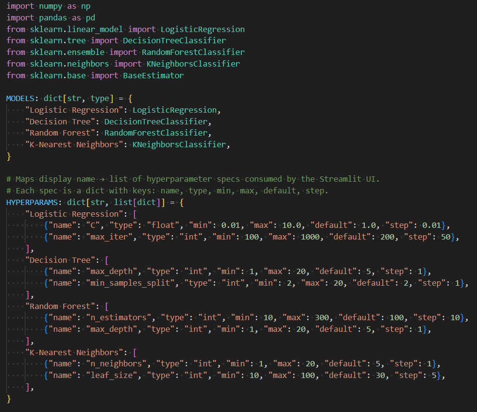

# 🛝ML Algorithm Playground

An interactive web app for exploring machine learning classification algorithms, built with Python and Streamlit.

Upload any CSV dataset, pick an algorithm, tune its hyperparameters with sliders, and instantly see accuracy, confusion matrix, ROC curve, and feature importances.

---

## Features
 
- **Upload any CSV** — or use the built-in Iris sample dataset
- **Experiment with 4 ML algorithms** — Logistic Regression, Decision Tree, Random Forest, K-Nearest Neighbors
- **Live hyperparameter tuning** — use the sliders to update the model on each run 
- **Visualizations** — key outputs rendered after each run include confusion matrix, ROC curve, feature importances
- **Clean architecture** — UI is separated from all ML logic
 
---

## Project Structure
 
```
ml-playground/
├── app.py                  # Streamlit UI (thin layer only)
├── src/
│   ├── data_handler.py     # data loading, train/test split
│   ├── preprocessing.py     # null handling, encoding, scaling
│   ├── models.py           # algorithm registry & training
│   └── metrics.py          # evaluation metrics & plots
├── assets/                 # screenshots used for documentation
├── requirements.txt
└── .gitignore
```
 
---

## Getting Started
 
### 1. Clone the repository
 
```bash
git clone https://github.com/danaizah/ML-Algorithm-Playground.git
cd ML-Algorithm-Playground
```
 
### 2. Create and activate a virtual environment
 
```bash
python -m venv venv
source venv/bin/activate       # macOS / Linux
venv\Scripts\activate          # Windows
```
 
### 3. Install dependencies
 
```bash
pip install -r requirements.txt
```
 
### 4. Run the app
 
```bash
streamlit run app.py
```

---
 
## Dataset Requirements
 
Your CSV must have:
- One column as the target (what to predict) — select it in the UI
- The target should be a categorical/class label

---
 
## Adding a New Algorithm
 
This project is built with extensibility in mind — adding a new ML algorithm only requires changes in the `src/models.py` file.

Open `src/models.py` and:
 ```
1. Import the scikit-learn class of your desired ML model
2. Add it to the `MODELS` dict
3. Add its hyperparameter spec to the `HYPERPARAMS` dict
 ```
The UI will pick it up automatically — no changes needed in `app.py`.


 
---

## Tech Stack
 
| Tool | Purpose |
|---|---|
| [Streamlit](https://streamlit.io) | Web UI |
| [scikit-learn](https://scikit-learn.org) | ML algorithms & preprocessing |
| [pandas](https://pandas.pydata.org) | Data handling |
| [matplotlib](https://matplotlib.org) / [seaborn](https://seaborn.pydata.org) | Visualizations |

